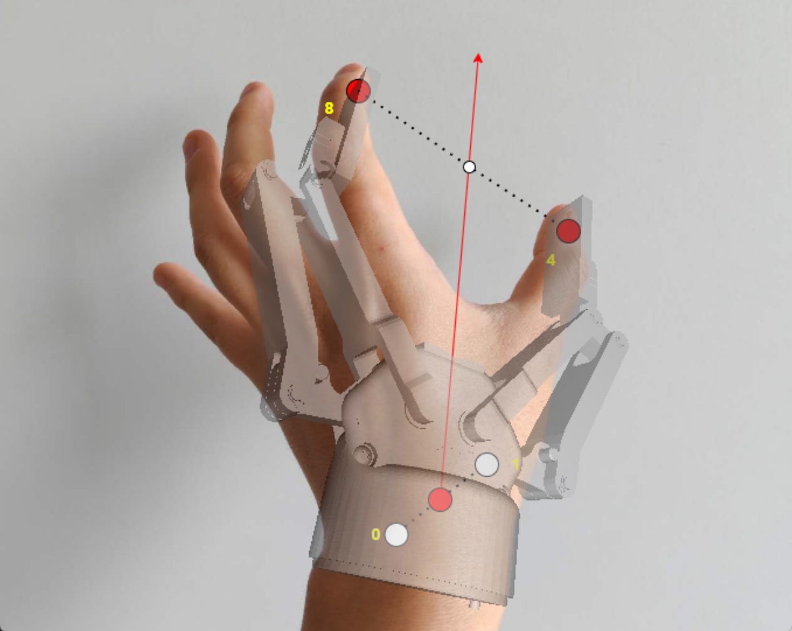

# Hand Keypoint detector

This is the repository of my AI Master's thesis work titled **"Low-Cost Imitation Learning for Dual-Arm Robots: Leveraging a Single Human Demonstration"** carried out at the University of Groningen under the supervision of Prof. Dr. Hamidreza Kasaei and Georgios Tziafas([IRL-Lab](https://www.ai.rug.nl/irl-lab/index.html)）.

This project focuses on predicting dual-arm robot trajectories directly from RGB human demonstration videos.

<p align="center">
  
</p>

## Installation
First you need to clone the repo:
```
git clone https://github.com/Jiayun-Zhang/Hand_keypoint_detector.git
```

Then, create a virtual environment python 3.10:

```
py -3.10 -m venv venv
.\venv\Scripts\activate
```
or

```
source venv/bin/activate
```

Install the the dependencies. Here we use CUDA 11.7.

```
pip install torch torchvision torchaudio --index-url https://download.pytorch.org/whl/cu117
pip install -e .[all]
pip install -v -e third-party/ViTPose

```

If install detectron2 failed, I tried to downgrade pip to 22.3 and it works

```
pip install pip==22.3.1   
pip install git+https://github.com/facebookresearch/detectron2.git             

```

Download the trained model

```
bash fetch_demo_data.sh

```
## Demo
Next, we need to prepare a video of a dual-arm manipulation task from a first-person perspective, and then convert it into picture frames and put it in a folder.

After that, modify augments `img_folder` and `out_file`, and run the following command to use HaMeR to extract hand keypoints:
```
python run.py --img_folder C:/Users/Jiayun/Desktop/hamer/demos_new/take1/rgb --out_file keypoint_all_take1.json --batch_size=48 --full_frame

```

Then, modify the `rgb_folder`, `depth_folder` and `json_file` arguments and correct the position of key points using the depth map
```
python correct_kp_bias.py --rgb_folder "C:/Users/Jiayun/Desktop/data/empty-vase_take2/rgb" --depth_folder "C:/Users/Jiayun/Desktop/data/empty-vase_take2/depth" --json_file "empty-vase_keypoint_all_take2.json"
```

<h2 align="center">Hand Keypoints Visualization</h2>
<p align="center">
  
</p>

<p align="center">Convert hand key points into gripper poses and generate visualization videos</p>

Then, modify `rgb_folder`, `depth_folder` and `json_file`, run the following command to convert the hand keypoints to Gripper pose.
```bash
python hand_to_gripper.py --rgb_folder "C:/Users/Jiayun/Desktop/data/empty-vase_take2/rgb" --depth_folder "C:/Users/Jiayun/Desktop/data/empty-vase_take2/depth" --json_file "corrected_empty-vase_keypoint_all_take2.json" 
```

<h2 align="center">Gripper Pose Visualization</h2>
<p align="center">
  
</p>

<p align="center">Convert hand key points into gripper poses and generate visualization videos</p>

### Manually Annotating Gripper Open/Close States

To set the gripper states (open = 1, close = 0) in the keypoint annotation JSON file, use the provided `gripper.py` script.
You can customize the frame ranges by editing the `left_open_close_ranges` and `right_open_close_ranges` lists in the script:

```python
left_open_close_ranges = [
    [65, 203],  # close left gripper between these frames
]
right_open_close_ranges = [
    [115, 203],  # close right gripper between these frames
]
```
Finally, run `gripper.py`:
```
python gripper.py 
```

Finally, we got a file `corrected_empty-vase_keypoint_all_take2.json` and it contains the gripper pose for both hand.

# Acknowledgements
Parts of the code are taken or adapted from the following repos:

[HaMeR](https://github.com/geopavlakos/hamer)

[VitPose](https://github.com/ViTAE-Transformer/ViTPose)
